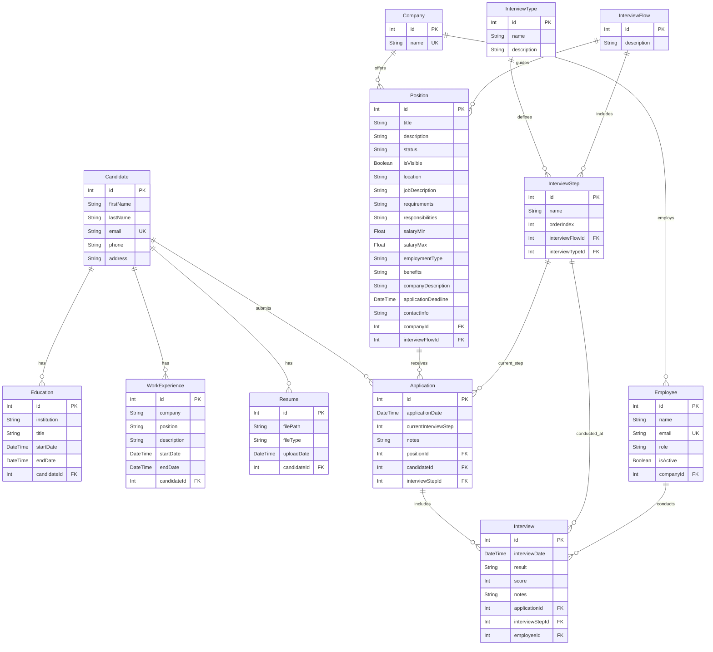

# Documentación del Modelo de Datos

Este documento describe el modelo de datos para el Proyecto Final del Máster AI4Devs, incluyendo descripciones de entidades, definiciones de campos, relaciones y un diagrama entidad-relación.

**PENDIENTE DE DEFINICIÓN, A GENERAR SEGÚN EJEMPLO INDICADO A CONTINUACIÓN:**

## Descripciones de Modelo

### 1. Candidate

Representa un candidato de trabajo que puede aplicar a posiciones dentro del sistema.

**Campos:**

- `id`: Identificador único para el candidato (Clave Primaria)
- `firstName`: Primer nombre del candidato (máx 100 caracteres)
- `lastName`: Apellido del candidato (máx 100 caracteres)
- `email`: Dirección de email única del candidato (máx 255 caracteres)
- `phone`: Número de teléfono del candidato (opcional, máx 15 caracteres)
- `address`: Dirección del candidato (opcional, máx 100 caracteres)

**Reglas de Validación:**

- Primer nombre y apellido son requeridos, 2-100 caracteres, solo letras
- Email es requerido, debe ser único y seguir formato de email válido
- Teléfono es opcional pero debe seguir formato español (6|7|9)XXXXXXXX si se proporciona
- Dirección es opcional pero no puede exceder 100 caracteres
- Máximo de 3 registros de educación por candidato

**Relaciones:**

- `educations`: Relación uno-a-muchos con el modelo Education
- `workExperiences`: Relación uno-a-muchos con el modelo WorkExperience
- `resumes`: Relación uno-a-muchos con el modelo Resume
- `applications`: Relación uno-a-muchos con el modelo Application

### 2. Education

Representa información de antecedentes educativos para candidatos.

**Campos:**

- `id`: Identificador único para el registro de educación (Clave Primaria)
- `institution`: Nombre de la institución educativa (máx 100 caracteres)
- `title`: Título de grado o certificación obtenida (máx 250 caracteres)
- `startDate`: Fecha de inicio del período educativo
- `endDate`: Fecha de fin del período educativo (opcional, null si está en curso)
- `candidateId`: Clave foránea que referencia al Candidate

**Reglas de Validación:**

- Institución es requerida y no puede exceder 100 caracteres
- Título es requerido y no puede exceder 250 caracteres
- Fecha de inicio es requerida y debe estar en formato de fecha válido
- Fecha de fin es opcional pero debe ser válida si se proporciona
- Máximo de 3 registros de educación por candidato

**Relaciones:**

- `candidate`: Relación muchos-a-uno con el modelo Candidate

### 3. WorkExperience

Representa historial laboral y experiencia profesional para candidatos.

**Campos:**

- `id`: Identificador único para el registro de experiencia laboral (Clave Primaria)
- `company`: Nombre de la empresa u organización (máx 100 caracteres)
- `position`: Título de trabajo o posición ocupada (máx 100 caracteres)
- `description`: Descripción de responsabilidades y logros (opcional, máx 200 caracteres)
- `startDate`: Fecha de inicio de la experiencia laboral
- `endDate`: Fecha de fin de la experiencia laboral (opcional, null si es actual)
- `candidateId`: Clave foránea que referencia al Candidate

**Reglas de Validación:**

- Nombre de empresa es requerido y no puede exceder 100 caracteres
- Posición es requerida y no puede exceder 100 caracteres
- Descripción es opcional pero no puede exceder 200 caracteres si se proporciona
- Fecha de inicio es requerida y debe estar en formato de fecha válido
- Fecha de fin es opcional pero debe ser válida si se proporciona

**Relaciones:**

- `candidate`: Relación muchos-a-uno con el modelo Candidate

### 4. Resume

Representa archivos de currículum cargados asociados con candidatos.

**Campos:**

- `id`: Identificador único para el registro de currículum (Clave Primaria)
- `filePath`: Ruta del sistema de archivos al currículum cargado (máx 500 caracteres)
- `fileType`: Tipo MIME o extensión de archivo del currículum (máx 50 caracteres)
- `uploadDate`: Fecha y hora cuando se cargó el currículum
- `candidateId`: Clave foránea que referencia al Candidate

**Reglas de Validación:**

- Ruta de archivo es requerida y no puede exceder 500 caracteres
- Tipo de archivo es requerido y no puede exceder 50 caracteres
- Fecha de carga se establece automáticamente cuando se carga el archivo
- Tipos de archivo soportados: PDF y DOCX (máx 10MB)

**Relaciones:**

- `candidate`: Relación muchos-a-uno con el modelo Candidate

### 5. Company

Representa empresas que publican posiciones de trabajo y emplean personal.

**Campos:**

- `id`: Identificador único para la empresa (Clave Primaria)
- `name`: Nombre único de empresa

**Relaciones:**

- `employees`: Relación uno-a-muchos con el modelo Employee
- `positions`: Relación uno-a-muchos con el modelo Position

### 6. Employee

Representa empleados dentro de empresas que pueden conducir entrevistas.

**Campos:**

- `id`: Identificador único para el empleado (Clave Primaria)
- `name`: Nombre completo del empleado
- `email`: Dirección de email única del empleado
- `role`: Rol o título de trabajo del empleado
- `isActive`: Booleano que indica si el empleado está actualmente activo
- `companyId`: Clave foránea que referencia a Company

**Relaciones:**

- `company`: Relación muchos-a-uno con el modelo Company
- `interviews`: Relación uno-a-muchos con el modelo Interview

### 7. InterviewType

Define diferentes tipos de entrevistas que pueden conducirse.

**Campos:**

- `id`: Identificador único para el tipo de entrevista (Clave Primaria)
- `name`: Nombre del tipo de entrevista (ej., "Technical", "HR", "Behavioral")
- `description`: Descripción detallada del tipo de entrevista (opcional)

**Relaciones:**

- `interviewSteps`: Relación uno-a-muchos con el modelo InterviewStep

### 8. InterviewFlow

Representa una secuencia de pasos de entrevista que definen el proceso de contratación.

**Campos:**

- `id`: Identificador único para el flujo de entrevista (Clave Primaria)
- `description`: Descripción del proceso de flujo de entrevista (opcional)

**Relaciones:**

- `interviewSteps`: Relación uno-a-muchos con el modelo InterviewStep
- `positions`: Relación uno-a-muchos con el modelo Position

### 9. InterviewStep

Representa pasos individuales dentro de un flujo de entrevista.

**Campos:**

- `id`: Identificador único para el paso de entrevista (Clave Primaria)
- `name`: Nombre del paso de entrevista
- `orderIndex`: Orden numérico de este paso dentro del flujo
- `interviewFlowId`: Clave foránea que referencia al InterviewFlow
- `interviewTypeId`: Clave foránea que referencia al InterviewType

**Relaciones:**

- `interviewFlow`: Relación muchos-a-uno con el modelo InterviewFlow
- `interviewType`: Relación muchos-a-uno con el modelo InterviewType
- `applications`: Relación uno-a-muchos con el modelo Application
- `interviews`: Relación uno-a-muchos con el modelo Interview

### 10. Position

Representa posiciones de trabajo disponibles para aplicación.

**Campos:**

- `id`: Identificador único para la posición (Clave Primaria)
- `companyId`: Clave foránea que referencia a Company (requerido)
- `interviewFlowId`: Clave foránea que referencia al InterviewFlow (requerido)
- `title`: Título del trabajo (requerido, máx 100 caracteres)
- `description`: Breve descripción de la posición (requerido)
- `status`: Estado actual de la posición (predeterminado: "Draft", valores válidos: Open, Contratado, Cerrado, Borrador)
- `isVisible`: Booleano que indica si la posición es públicamente visible (predeterminado: false)
- `location`: Ubicación del trabajo (requerido)
- `jobDescription`: Descripción detallada del trabajo (requerido)
- `requirements`: Requisitos y calificaciones del trabajo (opcional)
- `responsibilities`: Responsabilidades del trabajo (opcional)
- `salaryMin`: Rango mínimo de salario (opcional, debe ser >= 0)
- `salaryMax`: Rango máximo de salario (opcional, debe ser >= 0 y >= salaryMin)
- `employmentType`: Tipo de empleo (ej., "Full-time", "Part-time", "Contract") (opcional)
- `benefits`: Descripción de beneficios del trabajo (opcional)
- `companyDescription`: Descripción de la empresa contratante (opcional)
- `applicationDeadline`: Fecha límite para aplicaciones (opcional, debe ser una fecha futura)
- `contactInfo`: Información de contacto para consultas (opcional)

**Reglas de Validación:**

- Título es requerido y no puede exceder 100 caracteres
- Descripción, ubicación y jobDescription son campos requeridos
- Estado debe ser uno de: Open, Contratado, Cerrado, Borrador
- Referencias de empresa y flujo de entrevista deben existir en la base de datos
- Valores de salario deben ser números no negativos
- Fecha límite de aplicación debe ser una fecha futura si se proporciona

**Relaciones:**

- `company`: Relación muchos-a-uno con el modelo Company
- `interviewFlow`: Relación muchos-a-uno con el modelo InterviewFlow
- `applications`: Relación uno-a-muchos con el modelo Application

### 11. Application

Representa la aplicación de un candidato a una posición específica.

**Campos:**

- `id`: Identificador único para la aplicación (Clave Primaria)
- `applicationDate`: Fecha cuando se envió la aplicación
- `currentInterviewStep`: Paso actual en el proceso de entrevista
- `notes`: Notas adicionales sobre la aplicación (opcional)
- `positionId`: Clave foránea que referencia a Position
- `candidateId`: Clave foránea que referencia a Candidate
- `interviewStepId`: Clave foránea que referencia al InterviewStep actual

**Relaciones:**

- `position`: Relación muchos-a-uno con el modelo Position
- `candidate`: Relación muchos-a-uno con el modelo Candidate
- `interviewStep`: Relación muchos-a-uno con el modelo InterviewStep
- `interviews`: Relación uno-a-muchos con el modelo Interview

### 12. Interview

Representa sesiones individuales de entrevista conducidas como parte de una aplicación.

**Campos:**

- `id`: Identificador único para la entrevista (Clave Primaria)
- `interviewDate`: Fecha y hora de la entrevista
- `result`: Resultado o desenlace de la entrevista (opcional)
- `score`: Puntuación numérica o calificación de la entrevista (opcional)
- `notes`: Notas de entrevista y retroalimentación (opcional)
- `applicationId`: Clave foránea que referencia a Application
- `interviewStepId`: Clave foránea que referencia al InterviewStep
- `employeeId`: Clave foránea que referencia al Employee conductor

**Relaciones:**

- `application`: Relación muchos-a-uno con el modelo Application
- `interviewStep`: Relación muchos-a-uno con el modelo InterviewStep
- `employee`: Relación muchos-a-uno con el modelo Employee

## Diagrama Entidad-Relación

## Principios Clave de Diseño

1. **Integridad Referencial**: Todas las relaciones de claves foráneas aseguran consistencia de datos a través del sistema.

2. **Flexibilidad**: El sistema de flujo de entrevista permite procesos de contratación personalizables por posición.

3. **Rastro de Auditoría**: Las fechas de aplicación y entrevista proporcionan una línea de tiempo completa del proceso de contratación.

4. **Extensibilidad**: El diseño modular permite fácil adición de nuevas funcionalidades y puntos de datos.

5. **Normalización de Datos**: El modelo sigue principios de normalización de base de datos para minimizar redundancia y asegurar integridad de datos.

## Notas

- Todos los campos `id` sirven como claves primarias con funcionalidad de auto-incremento
- Las relaciones de clave foránea mantienen integridad referencial
- Los campos opcionales permiten entrada de datos flexible mientras mantienen información central requerida
- El sistema de entrevista soporta procesos de contratación de múltiples pasos con diferentes tipos de entrevistas
- Los campos de email tienen restricciones únicas para prevenir cuentas duplicadas
